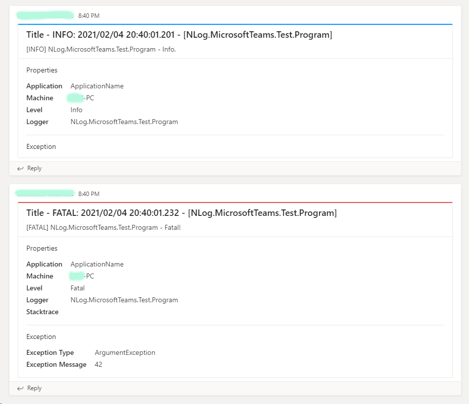

[](https://www.nuget.org/packages/NLog.Targets.MicrosoftTeams)
[](https://dev.azure.com/jedipi/NLog.Targets.MicrosoftTeams/_build/latest?definitionId=1&branchName=azure-pipelines)
# NLog.Targets.MicrosoftTeams
A NLog target that write log to Microsoft Teams channel via O365 Webhook Connector.

- Support for custom ApplicationName layout
- Support custom Teams card message title
- Configure your Webhook URL in app.config or appsetting.json

# Output


# Usage
```xml
<!-- Example app.config -->
<?xml version="1.0" encoding="utf-8" ?>
<configuration>
    <startup> 
        <supportedRuntime version="v4.0" sku=".NETFramework,Version=v4.7.2" />
    </startup>
  <appSettings>
    <add key="Logging.TeamsUrl" value="Your Teams Channel Webhook" />
  </appSettings>
</configuration>
```


NLog.config
```xml
<!-- This is an nlog.conf for app.config -->
<!-- write logs to Microsoft Teams -->
<target xsi:type="MicrosoftTeams" 
         name="msTeams" 
         WebhookUrl="${appsetting:name=Logging.TeamsUrl}"          
         ApplicationName="Your Application Name"
         CardTitle="Title - ${level:uppercase=true}: ${date} - [${logger}]"
         layout="[${level:uppercase=true}] ${logger} - ${message} ${all-event-properties}"
    />
```

```xml

<!-- This is an nlog.conf for appsetting.json -->
<!-- write logs to Microsoft Teams -->
<target xsi:type="MicrosoftTeams" 
         name="msTeams" 
         WebhookUrl="${configsetting:name=Logging.TeamsUrl}"          
         ApplicationName="Your Application Name"
         CardTitle="Title - ${level:uppercase=true}: ${date} - [${logger}]"
         layout="[${level:uppercase=true}] ${logger} - ${message} ${all-event-properties}"
    />
```
