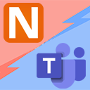

[](https://www.nuget.org/packages/NLog.Targets.MicrosoftTeams)
[](https://dev.azure.com/jedipi/NLog.Targets.MicrosoftTeams/_build/latest?definitionId=1&branchName=master)
[](https://github.com/jedipi/NLog.Targets.MicrosoftTeams/actions/workflows/dotnet.yml)

[](https://www.nuget.org/packages/NLog.Targets.MicrosoftTeams)
[](https://github.com/jedipi/NLog.Targets.MicrosoftTeams)
##### Build History
[](https://github.com/jedipi/NLog.Targets.MicrosoftTeams/actions?query=branch%3Amaster)
<br><br>

# NLog.Targets.MicrosoftTeams 

<br>
A NLog target that write log to Microsoft Teams channel via O365 Webhook Connector.

- Support custom ApplicationName layout
- Support custom Teams message card title
- Support .Net Framework, .Net Core, .Net 5, and .Net Standard
- Options to configure your Webhook URL in NLog.conf, app.config, or appsetting.json


For more Information about webhhoks in Teams read:
- https://docs.microsoft.com/en-us/microsoftteams/platform/webhooks-and-connectors/what-are-webhooks-and-connectors
- https://docs.microsoft.com/en-us/microsoftteams/platform/webhooks-and-connectors/how-to/add-incoming-webhook

# Output


# Getting Started
### Installation 

Add the NLog.Targets.MicrosoftTeams package from nuget to your project.

```cmd
PM> Install-Package NLog.Targets.MicrosoftTeams
```

<br>

### Usage
```xml
<!-- Example app.config -->
<?xml version="1.0" encoding="utf-8" ?>
<configuration>
    <startup> 
        <supportedRuntime version="v4.0" sku=".NETFramework,Version=v4.7.2" />
    </startup>
  <appSettings>
    <add key="Logging.TeamsUrl" value="Your Teams Channel Webhook" />
  </appSettings>
</configuration>
```


NLog.config
```xml
<!-- Example for getting Webhook URL from app.config -->
<!-- write logs to Microsoft Teams -->
<target xsi:type="MicrosoftTeams, NLog.Targets.MicrosoftTeams" 
         name="msTeams" 
         WebhookUrl="${appsetting:name=Logging.TeamsUrl}"          
         ApplicationName="Your Application Name"
         CardTitle="Title - ${level:uppercase=true}: ${date} - [${logger}]"
         layout="[${level:uppercase=true}] ${logger} - ${message} ${all-event-properties}"
    />
```

```xml

<!-- Example for getting Webhook URL from appsetting.json -->
<!-- write logs to Microsoft Teams -->
<target xsi:type="MicrosoftTeams, NLog.Targets.MicrosoftTeams" 
         name="msTeams" 
         WebhookUrl="${configsetting:name=Logging.TeamsUrl}"          
         ApplicationName="Your Application Name"
         CardTitle="Title - ${level:uppercase=true}: ${date} - [${logger}]"
         layout="[${level:uppercase=true}] ${logger} - ${message} ${all-event-properties}"
    />
```

```xml

<!-- Example for setting Webhook URL inside nlog.conf -->
<!-- write logs to Microsoft Teams -->
<target xsi:type="MicrosoftTeams, NLog.Targets.MicrosoftTeams" 
         name="msTeams" 
         WebhookUrl="Your Teams Webhook URL here"          
         ApplicationName="Your Application Name"
         CardTitle="Title - ${level:uppercase=true}: ${date} - [${logger}]"
         layout="[${level:uppercase=true}] ${logger} - ${message} ${all-event-properties}"
    />
```


# Support
If you've got value from any of the content which I have created, then I would also very much appreciate your support by buying me a beer.

[](https://www.paypal.com/donate/?hosted_button_id=WW82TCHX3P6EG)


