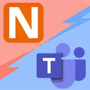

[](https://www.nuget.org/packages/NLog.Targets.MicrosoftTeams)
[](https://dev.azure.com/jedipi/NLog.Targets.MicrosoftTeams/_build/latest?definitionId=1&branchName=master)
[](https://github.com/jedipi/NLog.Targets.MicrosoftTeams/actions/workflows/dotnet.yml)

[](https://www.nuget.org/packages/NLog.Targets.MicrosoftTeams)
[](https://github.com/jedipi/NLog.Targets.MicrosoftTeams)
##### 构建历史
[](https://github.com/jedipi/NLog.Targets.MicrosoftTeams/actions?query=branch%3Amaster)
##### Star关注者和Fork分支者
[](https://github.com/jedipi/NLog.Targets.MicrosoftTeams/stargazers)
[](https://github.com/jedipi/NLog.Targets.MicrosoftTeams/network/members)


# NLog.Targets.MicrosoftTeams 

<br>
NLog.Targets.MicrosoftTeams 是一个用于将日志输出到 Microsoft Teams 频道的 NLog 目标组件，通过 O365 Webhook 连接器实现。

- 支持自定义应用程序名称(ApplicationName)布局
- 支持自定义 Teams 消息卡片标题
- 支持 .Net Framework、.Net Core、.Net 5/6/7/8 和 .Net Standard
- 可以在 NLog.conf、app.config 或 appsetting.json 中配置你的 Webhook URL


了解 Teams 中 Webhook 的更多信息，请参阅：
- https://docs.microsoft.com/en-us/microsoftteams/platform/webhooks-and-connectors/what-are-webhooks-and-connectors
- https://docs.microsoft.com/en-us/microsoftteams/platform/webhooks-and-connectors/how-to/add-incoming-webhook

# 输出展示


# 快速开始
### 安装 

通过 NuGet 将 NLog.Targets.MicrosoftTeams 包添加到你的项目中：

```cmd
PM> Install-Package NLog.Targets.MicrosoftTeams


<br>

### Usage
```xml
<!-- 示例 app.config -->
<?xml version="1.0" encoding="utf-8" ?>
<configuration>
    <startup> 
        <supportedRuntime version="v4.0" sku=".NETFramework,Version=v4.7.2" />
    </startup>
  <appSettings>
    <add key="Logging.TeamsUrl" value="你的Teams频道Webhook" />
  </appSettings>
</configuration>
```


NLog.config
```xml
NLog.config
<!-- 示例：从 app.config 获取 Webhook URL -->
<!-- 将日志输出到 Microsoft Teams -->
<target xsi:type="MicrosoftTeams, NLog.Targets.MicrosoftTeams" 
         name="msTeams" 
         WebhookUrl="${appsetting:name=Logging.TeamsUrl}"          
         ApplicationName="你的应用名称"
         CardTitle="标题 - ${level:uppercase=true}: ${date} - [${logger}]"
         layout="[${level:uppercase=true}] ${logger} - ${message} ${all-event-properties}"
    />
```

```xml
<!-- 示例：从 appsetting.json 获取 Webhook URL -->
<!-- 将日志输出到 Microsoft Teams -->
<target xsi:type="MicrosoftTeams, NLog.Targets.MicrosoftTeams" 
         name="msTeams" 
         WebhookUrl="${configsetting:name=Logging.TeamsUrl}"          
         ApplicationName="你的应用名称"
         CardTitle="标题 - ${level:uppercase=true}: ${date} - [${logger}]"
         layout="[${level:uppercase=true}] ${logger} - ${message} ${all-event-properties}"
    />
```

```xml

<!-- 示例：在 nlog.conf 中设置 Webhook URL -->
<!-- 将日志输出到 Microsoft Teams -->
<target xsi:type="MicrosoftTeams, NLog.Targets.MicrosoftTeams" 
         name="msTeams" 
         WebhookUrl="你的 Teams Webhook URL 在此处填写"          
         ApplicationName="你的应用名称"
         CardTitle="标题 - ${level:uppercase=true}: ${date} - [${logger}]"
         layout="[${level:uppercase=true}] ${logger} - ${message} ${all-event-properties}"
    />

```


# Support
如果你觉得我创建的内容有价值，欢迎通过以下方式支持我：

[](https://www.paypal.com/donate/?hosted_button_id=WW82TCHX3P6EG)


